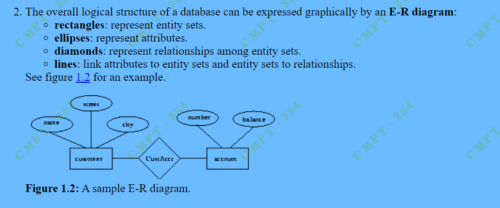

[Purpose of databases](https://www2.cs.sfu.ca/CourseCentral/354/han/material/notes/354notes-chapter1/node3.html)

# E-R DIAGRAM

  ***

> Database Manipulation Language : Statements for querying and modifying data.
SELECT, UPDATE, INSERT, DELETE

> Data Definition Language: Statements for defining database.
CREATE, DROP, ALTER

> Data Control Language: Statement for assigning permission.
GRANT, REVOKE, DENY

***

> NORMALIZATION TERMS:

* Entity: formally a table.
* Attribute: Description of an entity.
* Primary Key: Unique identifier.
* Composite Key: Multiple columns to make a unique key
* Candidate Key: All the unique keys which play candidates for a primary key | Primary key can only be one.
* Dependencies: one attribute being dependent on other unique key.

***

> DENORMALIZATION:

* In denormalization, data is stored in many many different tables which is good performing DDL.
But for making queries daily on multiple tables makes it more difficult as there is extra processing to fetch data from multiple tables.
We join the tables in order to provide the output of the queries frequently made.

***

# Normalization forms

> 1. First Normal Form:

* Attribute should have atomic value and must belong to same domain.

> 2. Second normal forms:

* Non key columns must not be dependent on part of the primary key or candidate key. | No Partially dependency.
if AB->X then there shouldn't be any B->X or A->X.

> 3. Third Normal Forms:

* It should not have transitive dependency. 
All attributes must be dependent only on the key. There shouldn't be any non key attriubute on which any other attribute would be dependent. | No Transitive dependency. 

>4. Boyce Codd Normal form:

* For any dependeny X -> Y. X should be super key.
In other words, if there is a surrogate key which can also perform as primary key then all the columns must be dependent on that 
key also.

***

> Functional Dependency:

* If Y is Functionally dependent on X i.e., X->Y then X can uniquely identify Y means for any given value of X, value of Y will always remain same.

Y is not dependent on X but X is dependent on Y.

| X   | Y   |
| --- | --- |
| 1   | 2   |
| 1   | 3   |
| 2   | 4   |

***