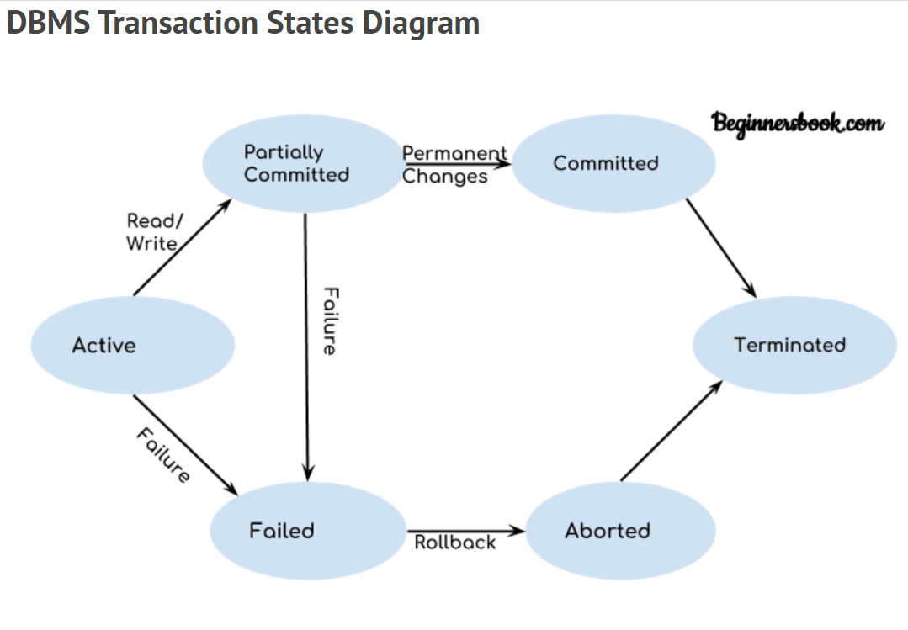

# Transactions

## ACID Properties

> ATOMICITY

* example: balance transfer  
  transfer Rs.10 from A -> B.  
  Steps for transfer:  
  1. Read(A)
  2. Update(A) => A = A-10
  3. Write(A)
  4. Read(B)
  5. Update(B) => B = B+10
  6. Write(B)
  7. Finish
* In this case Either All steps execute Or None of them execute. If failure happens at any step before completion then rollback happens.

> CONSISTENCY

* If a database is consistent before transaction then it will remain consistent afterwards.
* Any transaction must follow all the rules related to database including constraint, triggers etc.

> ISOLATION

* Logical Isolation : All the parallel transactions occur independently.
* The transactions occur such that they are happening independently.
* Example: Different orders happen in a restraunt parallely independent of each other.
* Concurrency control component takes care of isolation.

> DURABILITY

* Values in a database after transaction should always persist.

## States of transaction

